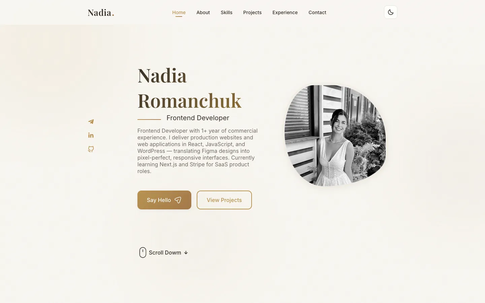

# Nadia Romanchuk — Frontend Developer Portfolio

Modern, responsive portfolio website built with **React**, **TypeScript**, and a warm cream & gold design system.  
Showcases projects, skills, experience, and a contact form — deployed on GitHub Pages.

[](https://nadiaturko.github.io/portfolio/)
[](https://react.dev/)
[](https://www.typescriptlang.org/)

---

## Preview



**[→ Open live site](https://nadiaturko.github.io/portfolio/)**

---

## About

Personal portfolio of **Nadia Romanchuk**, a Frontend Developer from Lviv, Ukraine, with 1+ year of commercial experience. The site presents a professional profile, selected projects, tech stack, work history, and direct contact options.

Designed as a single-page application with smooth scroll navigation, scroll animations, and full mobile responsiveness.

---

## Features

- **Hero section** — introduction, profile photo, social links, and call-to-action buttons
- **About** — photo with status badge, stats, highlights, and downloadable CV
- **Skills** — categorized cards (Frontend, Languages & Web, Tools & Workflow, AI & Growth)
- **Projects** — BookTrack SPA and Dental Clinic website with previews and links
- **Experience & Education** — interactive timeline tabs
- **Contact form** — EmailJS integration
- **Dark / Light theme** — persistent toggle with `localStorage`
- **Modern UI details** — mesh gradient background, scroll progress bar, scroll spy navigation, glass header, reveal animations

---

## Tech Stack

| Category | Technologies |
|----------|-------------|
| **Core** | React 18, TypeScript, Create React App |
| **Styling** | CSS3, CSS Variables, Flexbox & Grid |
| **Architecture** | SOLID-oriented structure, data layer separation, custom hooks |
| **Integrations** | EmailJS, Boxicons, Unicons |
| **Deploy** | GitHub Pages (`gh-pages`) |

---

## Project Structure

```
src/
├── assets/              # Images, CV, barrel exports
├── components/          # UI sections & reusable components
│   ├── about/
│   ├── common/          # Reveal, MeshBackground, ScrollProgress, etc.
│   ├── contact/
│   ├── header/
│   ├── home/
│   ├── projects/
│   ├── qualification/
│   └── skills/
├── context/             # ThemeContext
├── data/                # Content (navigation, skills, projects, …)
├── hooks/               # Scroll, navigation, tabs
├── services/            # EmailJS service
└── types/               # Shared TypeScript interfaces
```

Content is separated from presentation: update copy and links in `src/data/` without touching components.

---

## Getting Started

### Prerequisites

- Node.js 18+
- npm

### Installation

```bash
git clone https://github.com/nadiaturko/portfolio.git
cd portfolio
npm install
```

### Development

```bash
npm start
```

Open [http://localhost:3000/portfolio](http://localhost:3000/portfolio) in your browser.

### Production build

```bash
npm run build
```

### Deploy to GitHub Pages

```bash
npm run deploy
```

---

## Scripts

| Command | Description |
|---------|-------------|
| `npm start` | Start development server |
| `npm run build` | Create production build |
| `npm test` | Run test suite |
| `npm run deploy` | Build and publish to GitHub Pages |

---

## Featured Projects

| Project | Description | Links |
|---------|-------------|-------|
| **BookTrack** | Book-tracking SPA with Firebase Auth, favorites, and progress tracking | [Demo](https://nadiaturko.github.io/booktrack/) · [GitHub](https://github.com/NadiaTurko/booktrack) |
| **Dental Clinic** | Marketing site from Figma to production with Gulp pipeline | [Live site](https://ronevich.com.ua/) |

---

## Contact

- **Email:** [nadrom0211@gmail.com](mailto:nadrom0211@gmail.com)
- **Telegram:** [@nadrom0211](https://t.me/nadrom0211)
- **LinkedIn:** [Nadia Romanchuk](https://www.linkedin.com/in/nadiia-romanchuk-42930630a/)
- **GitHub:** [nadiaturko](https://github.com/nadiaturko)

---

## License

This project is open source and available for personal and educational use.

---

<p align="center">
  Built with care by <strong>Nadia Romanchuk</strong> · Lviv, Ukraine
</p>
